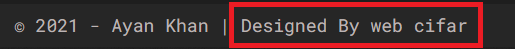

# Ayan's Portfolio website [React Project]

## Live Preview: [Open Link][preview]

Coded by - [shaif Arfan](http://instagram.com/shaifarfan08) | [web cifar](http://webcifar.com)


## Project Details

A portfolio for a web designer. We used React js to make this portfolio. A clean design with full responsiveness. You will find this portfolio very professional. Also we added smooth scroll in the portfolio which will make the user experience really elegant.

## Project Requirement

1. HTML, CSS
1. JavaScript
1. React Basic

## What we are going to Use/learn

- React
- React Hooks
- Styled Components
- Swiper js
- React Transition Group
- Smooth Scrollbar
- React Icons
- React Router Dom
- More...

## Starter Files

For the starter files, we created a `branch` in this repository named `starter_files`. You need to change the branch in the top corner of the repo then you will get the starter files and now you can clone the repo or `download` it.

## Getting Started

After getting the starter files, you need to go the file directory and run

```shell
npm install
```

and after that start the server.

```shell
npm start
```

### If you like the tutorial, please share this with others.

## want to use the website ?

This tutorial is made for educational purpose. Also this is free to use. Though if you use this website, you need to give us the proper credit for the website. keep the bottom footer part of the website.



[preview]: https://ayans-portfolio.netlify.app/
